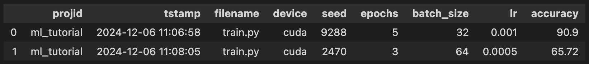
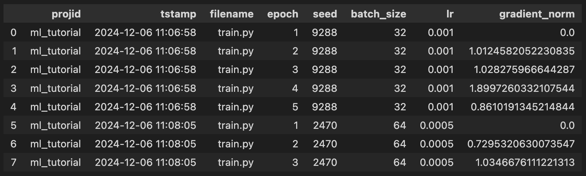

# ml_tutorial
Introduction to Flordb with PyTorch

## Hindsight Logging for when you miss something
Hindsight logging is a post-hoc analysis practice that involves adding logging statements *after* encountering a surprise, and efficiently re-training with more logging as needed. FlorDB supports hindsight logging across multiple versions with its record-replay sub-system.


### Record the first two runs
Once you have the repository cloned, and the dependencies installed, you can record the first run with FlorDB:

```bash
python train.py
```
```bash
Created and switched to new branch: flor.shadow
device: cuda
seed: 9288
hidden: 500
epochs: 5
batch_size: 32
lr: 0.001
print_every: 500
epoch: 0, step: 500, loss: 0.5111837387084961
epoch: 0, step: 1000, loss: 0.33876052498817444
...
epoch: 4, step: 1500, loss: 0.5777633786201477
epoch: 4, val_acc: 90.95  
5it [00:23,  4.68s/it]    
accuracy: 90.9
correct: 9090
Changes committed successfully.
```
Notice that the `train.py` script logs the loss and accuracy during training. The loss is logged for each step, and the accuracy is logged at the end of each epoch.

Next, you'll want to run training with different hyper-parameters. You can do this by setting the hyper-parameters from the command line:

```bash
python train.py --kwargs epochs=3 batch_size=64 lr=0.0005
```
```bash
device: cuda
seed: 2470
hidden: 500
epochs: 3
batch_size: 64
lr: 0.0005
print_every: 500
epoch: 0, step: 500, loss: 0.847846508026123
epoch: 0, val_acc: 65.65 
epoch: 1, step: 500, loss: 0.9502124786376953
epoch: 1, val_acc: 65.05 
epoch: 2, step: 500, loss: 0.834592342376709
epoch: 2, val_acc: 66.65 
3it [00:11,  3.98s/it]   
accuracy: 65.72
correct: 6572
Changes committed successfully.
```

Now, you have two runs recorded in FlorDB. You can view the hyper-parameters and metrics logged during training with the `flor.dataframe` function:

```python
import flor
flor.dataframe("device", "seed", "epochs", "batch_size", "lr", "accuracy")
```


### Replay the previous runs

Whenever something looks wrong during training, you can use FlorDB to replay the previous runs and log additional information, like the gradient norm. To log the gradient norm, you can add the following line to the training script:

```python
flor.log("gradient_norm", 
    torch.nn.utils.clip_grad_norm_(
        model.parameters(), max_norm=float('inf')
    ).item()
)
```

We add the `flor.log` statement to the training script, inside the loop that iterates over the epochs:

```python
with flor.checkpointing(model=net, optimizer=optimizer):
    for epoch in flor.loop("epoch", range(num_epochs)):
        
        # hindsight logging: gradient norm
        flor.log("gradient_norm", 
            torch.nn.utils.clip_grad_norm_(
                model.parameters(), max_norm=float('inf')
            ).item()
        )

        for data in flor.loop("step", trainloader):
            inputs, labels = data
            optimizer.zero_grad()
            outputs = net(inputs)
            loss = criterion(outputs, labels)
            loss.backward()
            optimizer.step()
            flor.log("loss", loss.item())

        # Evaluate the model on the test set
        eval(net, testloader)
```

We call the Flor Replay function with the name of the (comma-separated) variable(s) we want to hindsight log. In this case, we want to hindsight log the gradient norm at the start of each epoch, so we pass the variable name `gradient_norm`. From the command line:

```bash
python -m flor replay gradient_norm
```
```
Changes committed successfully.
log level outer loop without suffix.

        projid              tstamp  filename  ...        delta::prefix       delta::suffix composite
0  ml_tutorial 2024-12-06 11:06:58  train.py  ...   0.4068293860000267  0.5810907259983651  6.632383
1  ml_tutorial 2024-12-06 11:08:05  train.py  ...  0.35641806300009193  0.5474109189999581  4.340672

[2 rows x 17 columns]

Continue replay estimated to finish in under 2 minutes [y/N]? y
```
The replay command will print a schedule of past versions to be replayed, including timing data and intermediate metrics. Columns containing `::` are profiling columns that Flor uses to estimate the replay’s runtime, and the phrase "log level outer loop without suffix" tells you the replay strategy that Flor will pursue on each version, which in this case means skipping the nested loop and the stuff that comes after the main epoch loop.

When you confirm the replay, Flor will replay the past versions shown in the schedule, and hindsight log the gradient norm for each epoch. You can view the new metrics logged during replay with the `flor.dataframe` function:

```python
import flor
flor.dataframe("seed", "batch_size", "lr", "accuracy", "gradient_norm")
```
